# Emakefun Micro:bit PH2.0 Sensor:bit Extensions
### [详细介绍请看官网](https://emakefun-docs.readthedocs.io/zh_CN/latest/)
# Sensor:bit模块介绍
- [基础输入模块](#jump_1)
    - [矩阵键盘模块](#jump_1_1)
    - [触摸模块](#jump_1_2)
    - [按键模块](#jump_1_3)
    - [触碰模块](#jump_1_4)
    - [滑动变阻器模块](#jump_1_5)
    - [旋转电位器模块](#jump_1_6)
    - [摇杆模块](#jump_1_7)
    - [钢琴模块 V1](#jump_1_8)
    - [钢琴模块 V2](#jump_1_9)
    - [PH2.0手柄](#jump_1_10)
- [传感器](#jump_2)
    - [水蒸气传感器](#jump_2_1)
    - [LM35温度传感器](#jump_2_2)
    - [火焰传感器](#jump_2_3)
    - [红外循迹传感器](#jump_2_4)
    - [倾斜传感器](#jump_2_5)
    - [光敏传感器](#jump_2_6)
    - [热敏传感器](#jump_2_7)
    - [水深传感器](#jump_2_8)
    - [土壤湿度传感器](#jump_2_9)
    - [避障传感器](#jump_2_10)
    - [磁簧开关传感器](#jump_2_11)
    - [人体热源传感器](#jump_2_12)
    - [震动传感器](#jump_2_13)
    - [灰度传感器](#jump_2_14)
    - [声音传感器](#jump_2_15)
    - [雨滴传感器](#jump_2_16)
    - [MQ4气体传感器](#jump_2_17)
    - [RGB超声波传感器](#jump_2_18)
    - [普通超声波传感器](#jump_2_19)
    - [DHT11温湿度传感器](#jump_2_20)
    - [四路循迹传感器](#jump_2_21)
- [显示器](#jump_3)
    - [LED灯](#jump_3_1)
    - [RGB三色灯](#jump_3_2)
    - [交通灯](#jump_3_3)
    - [LCD1602显示屏](#jump_3_4)
    - [TM1637数码管](#jump_3_5)
    - [TM1650数码管](#jump_3_6)
- [执行器](#jump_4)
    - [有源蜂鸣器](#jump_4_1)
    - [无源蜂鸣器](#jump_4_2)
    - [继电器](#jump_4_3)
    - [直流电机](#jump_4_4)
    - [舵机](#jump_4_5)
    - [激光模块](#jump_4_6)

- [智能模块](#jump_5)
    - [语音识别模块](#jump_5_1)

## <a id="jump_1">基础输入模块</a>
### <a id="jump_1_1">1. 矩阵键盘模块</a>
- 初始化矩阵键盘引脚SCL,SDO  

- 实现Micro:bit读取显示键盘值  

- <a href="https://makecode.microbit.org/_7TtfV5XKvH50">示例程序</a>  
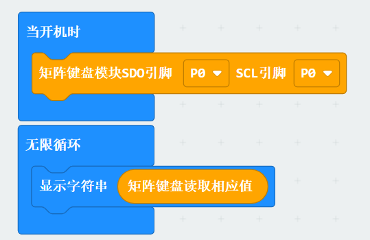
- 利用两个引脚获取数值，打显示相应的字母或数字
### <a id="jump_1_2">2. 触摸模块</a>
- 通过引脚检测是否被触摸  

- <a href="https://makecode.microbit.org/_5bXfq63TiM3m">示例程序</a>  
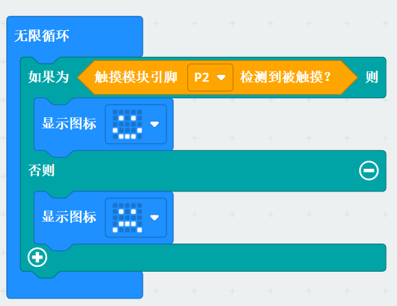 
- 当模块被触摸，则显示笑脸表情，否则显示难过表情 
### <a id="jump_1_3">3. 按键模块</a>
- 通过引脚检测按键是否被按下  

- <a href="https://makecode.microbit.org/_bHkRLAeXDeMo">示例程序</a>  
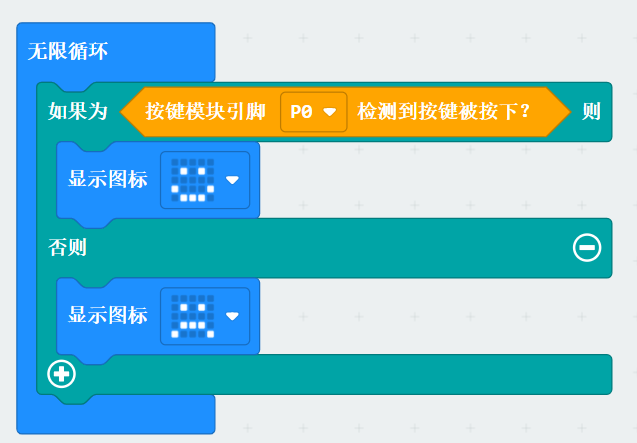
- 当按键按下，显示笑脸表情，否则显示难过表情
### <a id="jump_1_4">4. 触碰模块</a>
- 通过引脚来检测是否发生碰撞  

- <a href="https://makecode.microbit.org/_RDJbzTDUX2RW">示例程序</a>    
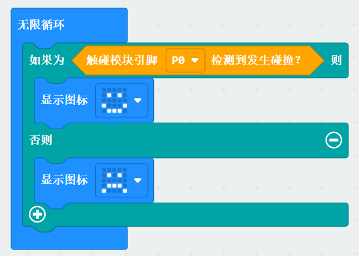
- 发生碰撞则显示开心表情，未发生则显示难过表情
### <a id="jump_1_5">5. 滑动变阻器模块</a>
- 通过引脚来获取变阻器当前的阻值(1~100)  

- <a href="https://makecode.microbit.org/_HaWXTmVJD6jf">示例程序</a>    

- 显示当前滑动变阻器的阻值，每一秒更新一次数值
### <a id="jump_1_6">6. 旋转电位器模块</a>
- 通过引脚来获取旋转电位器当前的电压值  

- <a href="https://makecode.microbit.org/_70ahCtDUCPtq">示例程序</a>    

- 显示当前旋转电位器的电压值，每一秒更新一次数值
### <a id="jump_1_7">7. 摇杆模块</a>
- 初始化引脚X,Y,B  

- 通过引脚X/Y获取模拟值  

- 判断按键是否被按下  

- <a href="https://makecode.microbit.org/_ahq11cX1E6JT">示例程序</a>  
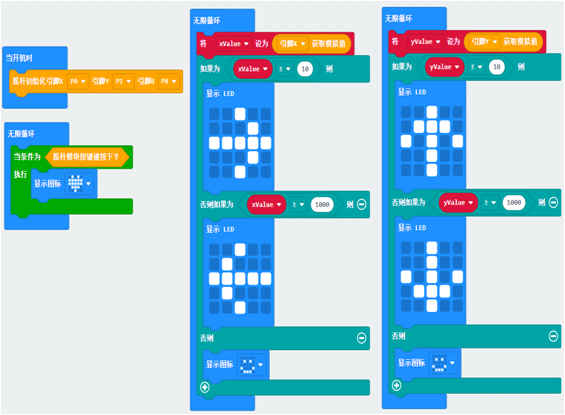
- 当向上/下/左/右推动摇杆时，LED点阵屏会打印出上/下/左/右的图案。当按下摇杆时，LED点阵屏会打印出一个开心的表情。
### <a id="jump_1_8">8. 钢琴模块 V1</a>
- 初始化引脚CLK,DIO
- 
- 实现是否弹奏钢琴
- 
- <a href="https://makecode.microbit.org/_Ve9WmrP1k6WE">示例程序</a>
- 
- 通过触摸到不同的按键，会产生不同的音乐
### <a id="jump_1_9">9. 钢琴模块 V2</a>
- 初始化引脚CLK,DIO
- 
- 实现是否弹奏钢琴
- 
- <a href="https://makecode.microbit.org/_c0cAijCb05w1">示例程序</a>
- 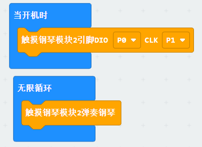
- 通过触摸到不同的按键，会产生不同的音乐
### <a id="jump_1_10">10. PH2.0手柄</a>
- PH2.0手柄默认连接I2C引脚(即P19，P20)，下面代码实现PH2.0的效果
- 获取手柄按键状态
- 
- 获取X/Y轴的值
- 
- 判断手柄按键是否被释放
- 
- 判断手柄按键是否被按下
- 
- <a href="https://makecode.microbit.org/_MU6Yt1gLoiFF">示例程序</a>
- 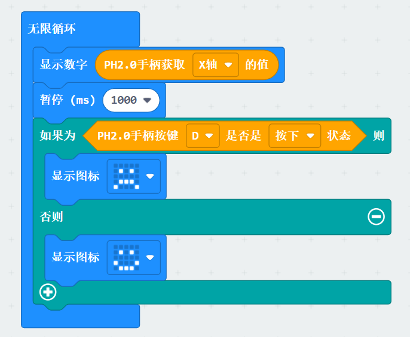 
- 获取X/Y轴的值，1秒以后，可以实现判断各个按键的状态的功能，若被按下则显示哭脸，释放状态下则显示笑脸
## <a id="jump_2">传感器</a>
### <a id="jump_2_1">1. 水蒸气传感器</a>
- 通过引脚来获取环境中水蒸气浓度
- 
- <a href="https://makecode.microbit.org/_b7fLPi2myAEa">示例程序</a>
-  
- 显示水蒸气浓度数值，每一秒更新一次显示
### <a id="jump_2_2">2. LM35温度传感器</a>
- 通过引脚来获取环境温度
-  
- <a href="https://makecode.microbit.org/_aFzUog2URKcP">示例程序</a>
- 
- 显示环境温度值，每一秒更新一次显示
### <a id="jump_2_3">3. 火焰传感器</a>
- 通过引脚获取的数字值判断周围存在火焰
- 
- 通过引脚来获取火焰的模拟值
- 
- <a href="https://makecode.microbit.org/_gmPdAJ7CX6zX">示例程序</a>
- 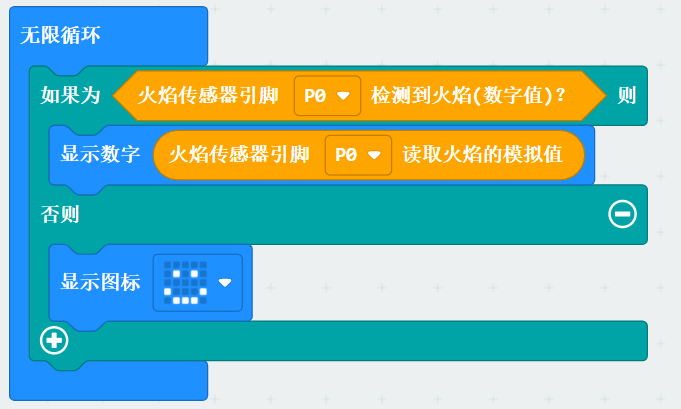
- 判断周围是否有火焰存在，若存在显示火焰的模拟值，不存在则显示笑脸。
### <a id="jump_2_4">4. 红外循迹传感器</a>
- 通过引脚来判断是否存在黑线
- 
- <a href="https://makecode.microbit.org/_8KJhf5XsoWqh">示例程序</a>
- 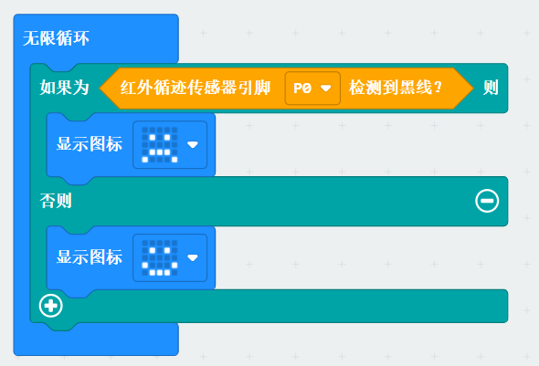
- 红外循迹传感器若感应到黑线，则显示哭脸，否则显示笑脸
### <a id="jump_2_5">5. 倾斜传感器</a>
- 通过引脚来判断是否倾斜     
- 
- <a href="https://makecode.microbit.org/_DhRKX9fpCL3a">示例程序</a>
- 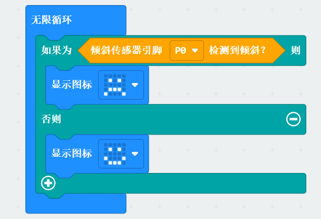
- 倾斜传感器感应到倾斜，则显示哭脸，否则显示笑脸
### <a id="jump_2_6">6. 光敏传感器</a>
- 通过引脚来获取光敏传感器感应到环境中光强的模拟值
- 
- <a href="https://makecode.microbit.org/_iHV8rCMPMUj4">示例程序</a>
-  
- 显示光照强度的模拟值，每一秒更新一次显示
### <a id="jump_2_7">7. 热敏传感器</a>
- 通过引脚来获取热度值
-  
- <a href="https://makecode.microbit.org/_56L5cVTJ5hU4">示例程序</a>
-  
- 显示环境热度值，每一秒更新一次显示
### <a id="jump_2_8">8. 水深传感器</a>
- 通过引脚获取水深值
- 
- <a href="https://makecode.microbit.org/_i1ALFJiz18yE">示例程序</a>  
- 
- 显示水深值，每一秒更新一次显示
### <a id="jump_2_9">9. 土壤湿度传感器</a>
- 通过引脚获取土壤湿度值
- 
- <a href="https://makecode.microbit.org/_8MceUJPKWUaq">示例程序</a>
- 
- 显示土壤湿度值，每一秒更新一次显示
### <a id="jump_2_10">10. 避障传感器</a>
- 通过引脚获取数字值判断前方是否有障碍物
- 
- <a href="https://makecode.microbit.org/_hHeEbt5H048T">示例程序</a>
- 
- 判断前方是否有障碍物，如果有显示哭脸，没有则显示笑脸
### <a id="jump_2_11">11. 磁簧开关传感器</a>
- 通过引脚获取数字值判断周围是否存在磁场
- 
- <a href="https://makecode.microbit.org/_7YVdWCRbdFRs">示例程序</a>
- 
- 磁簧开关传感器感应周围是否有磁场若存在则显示苦脸，不存在则显示笑脸
### <a id="jump_2_12">12. 人体热源传感器</a>
- 实现通过引脚来获得人体热源传感器得到的数字值，从而判断周围是否有环境热源的功能
- 
- <a href="https://makecode.microbit.org/_C6J5cuMMF8FU">示例程序</a>
- 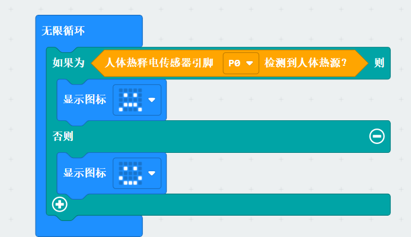
- 判断周围是否有人体热源，若存在则显示哭脸，若不存在则显示笑脸
### <a id="jump_2_13">13. 震动传感器</a>
- 震动传感器为4Pin传感器，连接的D口用于检测是否检测到震动(数字值)，A口连接的Pin口用于读取模拟值。
- 通过引脚获取震动传感器模拟值
- 
- 通过引脚获取震动传感器数字值
- 
- <a href="https://makecode.microbit.org/_fCchCF8pUWdR">示例程序</a>
- 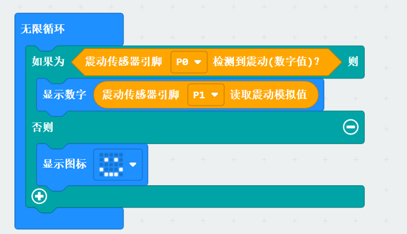
- 检测是否感应到震动，若发生震动显示震动强度的模拟值，若未发生则显示笑脸
### <a id="jump_2_14">14. 灰度传感器</a>
- 初始化引脚并读取颜色深度模拟值
- 
- <a href="https://makecode.microbit.org/_hj7ektMpLhXF">示例程序</a>
-     
- 实现显示颜色深度值
### <a id="jump_2_15">15. 声音传感器</a>
- 通过引脚获取声音传感器数字值
- 
- 通过引脚获取声音传感器模拟值
- 
- <a href="https://makecode.microbit.org/_JC4WUuDjj2oi">示例程序</a>
- 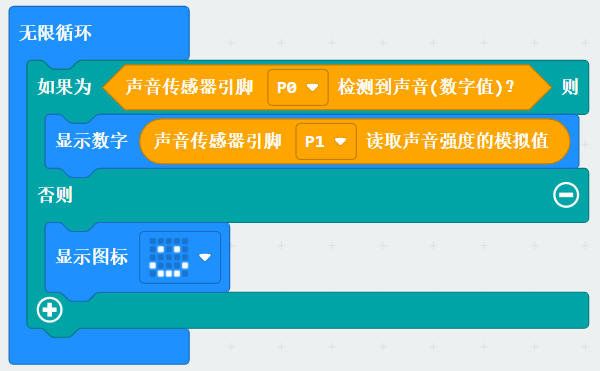
- 实现检测声音强度的功能，若有声音则显示声音强度值，没有声音则显示笑脸
### <a id="jump_2_16">16. 雨滴传感器</a>
- 通过引脚获取雨滴传感器数字值
- 
- 通过引脚获取雨滴传感器模拟值
- 
- <a href="https://makecode.microbit.org/_eMYca0KRdeTd">示例程序</a>
- 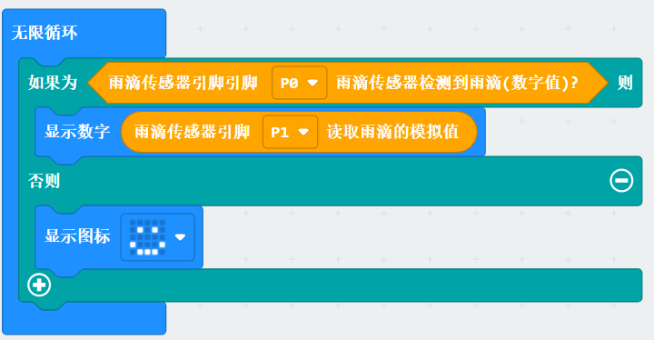
- 实现对雨滴值的检测功能，若下雨则显示雨滴模拟值，没下雨显示笑脸
### <a id="jump_2_17">17. MQ4气体传感器</a>
- 通过引脚获取MQ4气体传感器的数字值
- 
- 通过引脚获得MQ4气体传感器的模拟值
- 
- <a href="https://makecode.microbit.org/_A9cLTEb0o49g">示例程序</a>
- 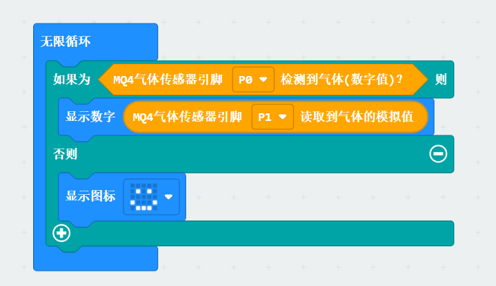
- 实现对气体(CO,甲烷，天然气等)的检测功能，若有该气体打印其浓度的模拟值，没有则显示笑脸
### <a id="jump_2_18">18. RGB超声波传感器</a>
- 通过引脚获得超声波所测得的距离值
- 
- 通过引脚控制探头RGB颜色和效果
- 
- <a href="https://makecode.microbit.org/_PtqVy7dDj4PJ">示例程序</a>
- 
- 实现利用RGB超声波传感器的测距和亮灯的功能
### <a id="jump_2_19">19. 普通超声波传感器</a>
- 通过引脚获取普通超声波传感器测得的距离值
- 
- <a href="https://makecode.microbit.org/_iq25Yo2Rged9">示例程序</a>
- 
- 显示测量出的距离值
### <a id="jump_2_20">20. DHT11温湿度传感器</a>
- 通过引脚获得环境湿度或温度的值
- 
- <a href="https://makecode.microbit.org/_YiMV02Ksuc73">示例程序</a>
- 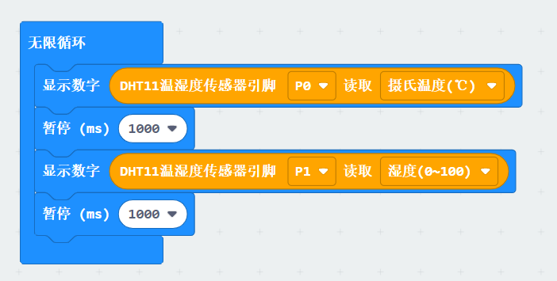
- 实现用DHT11温湿度传感器测温湿度的功能，分别通过点阵显示出来
- 对于Micro:bitV2同样有
- 
- <a href="https://makecode.microbit.org/_PFk2fcF7iDdr">示例程序</a>
- 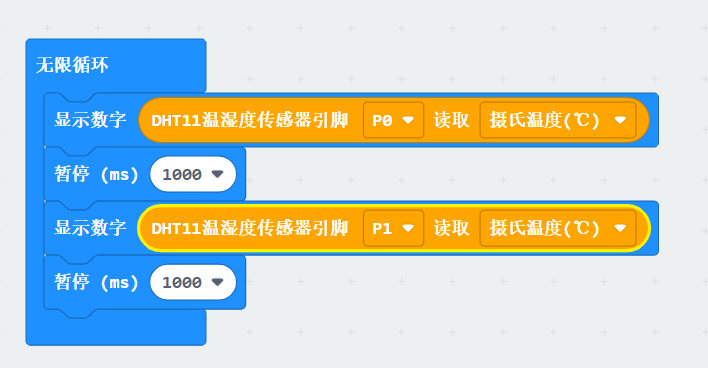
### <a id="jump_2_21">21. 四路循迹传感器</a>
- 判断周围是否有黑线
- 
- 初始化引脚
- 
- 获取四路循迹传感器值
- 
- <a href="https://makecode.microbit.org/_3UqgqL6Lb5jV">示例程序</a>
- 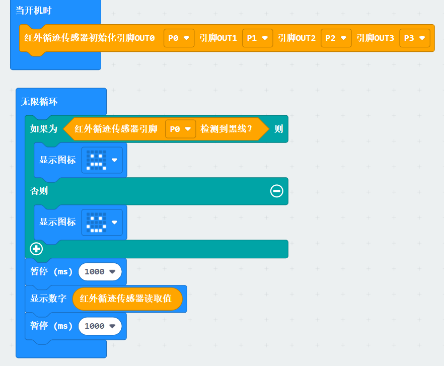
- 初始化传感器引脚，判断黑线的存在，存在则显示四路循迹传感器值，不存在则显示笑脸
## <a id="jump_3">显示器</a>
### <a id="jump_3_1">1. LED灯</a>
- 通过引脚控制灯的状态（打开或关闭）  

- <a href="https://makecode.microbit.org/_AH6JqT4trAid">示例程序</a>  
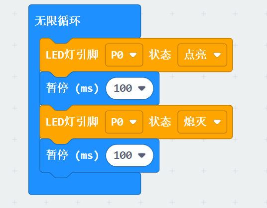 
- 实现对LED灯状态的控制功能,LED灯交替打开和关闭
### <a id="jump_3_2">2. RGB三色灯</a>
- 初始化引脚
- 
- 对灯进行对灯进行配色
- 
- <a href="https://makecode.microbit.org/_XjfaiRCi5b5E">示例程序</a>
- 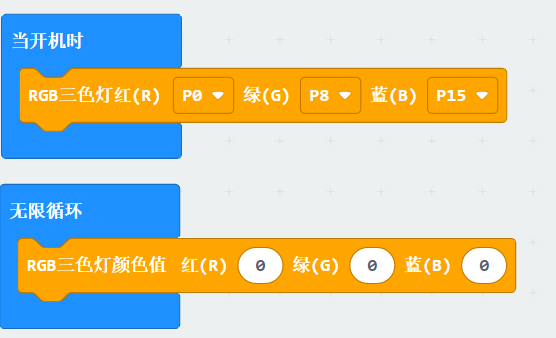
- 通过配色，实现对RGB三色灯颜色变换的功能
### <a id="jump_3_3">3. 交通灯</a>
- 初始化各个灯引脚
- 
- 设置灯的状态（点亮/熄灭）
- 
- <a href="https://makecode.microbit.org/_Kt8FkrJfR85T">示例程序</a>
- 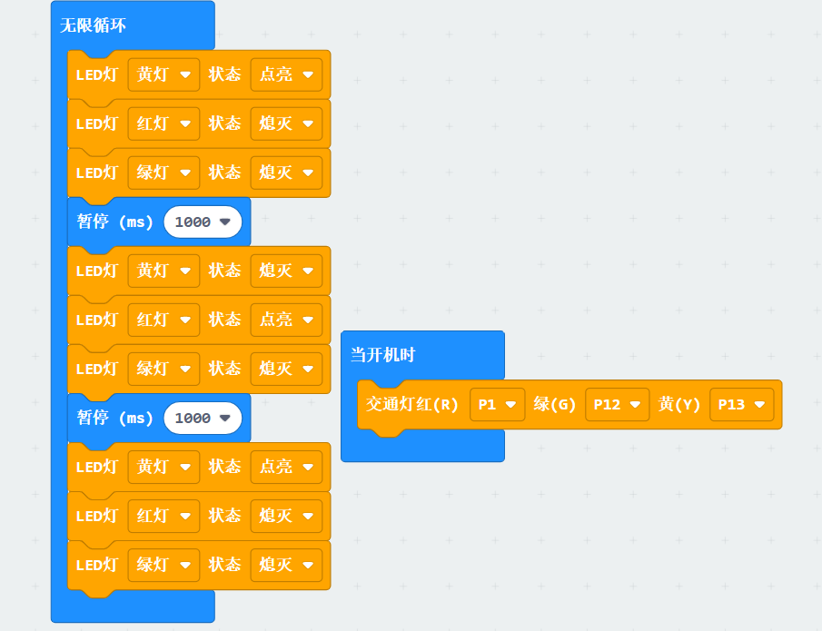   
- 通过对三个灯的控制实现交通灯的功能，红绿黄三种灯交替点亮和熄灭
### <a id="jump_3_4">4. LCD1602显示屏</a>
- 设置LCD1602显示屏的IC2地址，十进制默认为39，十六进制默认为0x27
- 
- 使LCD1602显示屏相应位置显示字符
- 
- 使LCD1602显示屏相应位置显示数字
- 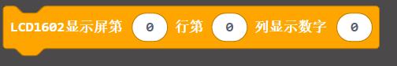
- 使LCD1602显示屏相应位置显示字符串
- 
- 打开或关闭LCD1602显示屏
- 
- 打开或关闭LCD1602显示屏背光灯
- 
- <a href="https://makecode.microbit.org/_f4Mccy84xdcC">示例程序</a>
- 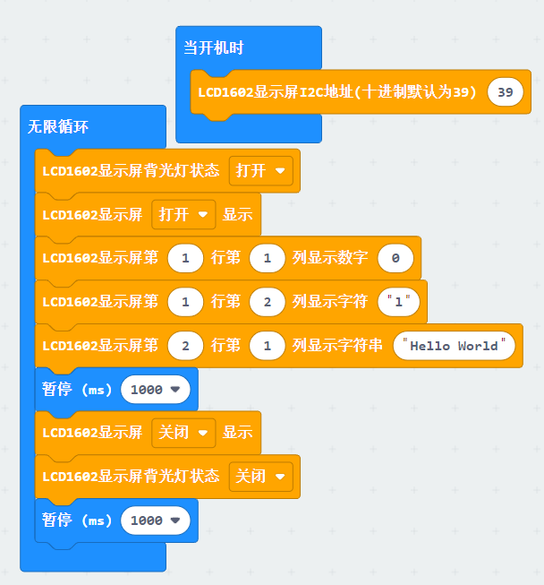
- 设置默认地址，执行循环，打开LCD1602显示屏和背光灯，在第1行第一列显示0，第二列显示l，第2行第一列显示字符串“Hello World"
1s后关闭屏幕和背光灯，1s后循环重新开始
### <a id="jump_3_5">5. TM1637数码管</a>
- 设置数码管引脚显示亮度，显示位数
- 
- 使TM1637数码管显示数字
- 
- 使TM1637数码管显示十六进制数字
- 
- 使TM1637数码管对应位置显示数字
- 
- 调节亮度
- 
- TM1637数码管打开显示
- 
-  TM1637数码管关闭显示
- 
- TM1637数码管清除显示
- 
- 点亮或熄灭相应位置上的点
- 
- <a href="https://makecode.microbit.org/_C2033f7z7WLL">示例程序</a>
- 
- 实现利用TM1637数码管实现计时功能
### <a id="jump_3_6">6. TM1650数码管</a>
- 使TM1650数码管显示数字
- 
- 使TM1650数码管显示十六进制数字
- 
- 使TM1650数码管相应位置上的点点亮或熄灭
- 
- 使TM1650数码管对应位置显示数字
- 
- 设置TM1650数码管显示亮度
- 
- <a href="https://makecode.microbit.org/_5AVM1M6WWFTJ">示例程序</a>
- 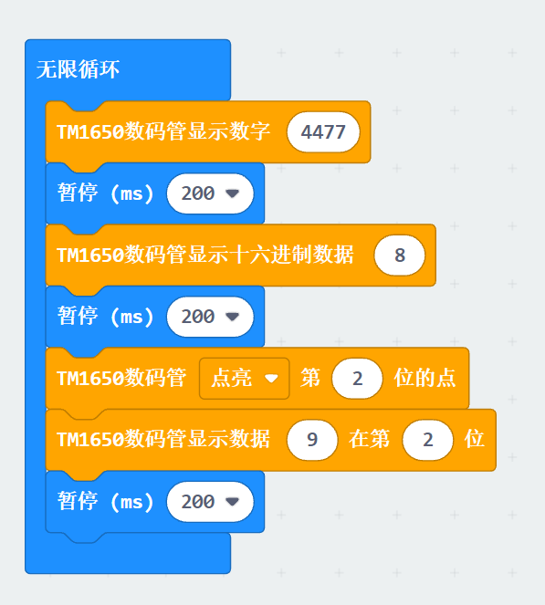
- 先显示数字4477，1s之后显示8（16进制）1s后点亮第二位的点，在第二位显示9，持续1s，以此循环
## <a id="jump_4">执行器</a>
### <a id="jump_4_1">1. 有源蜂鸣器</a>
- 通过引脚控制有源蜂鸣器
- 
- <a href="https://makecode.microbit.org/_Fs1VH7MrtPAv">示例程序</a>
- 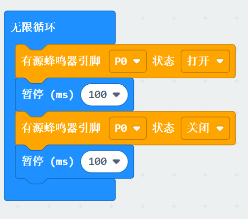
- 有源蜂鸣器间接性打开关闭
### <a id="jump_4_2">2. 无源蜂鸣器</a>
- 通过引脚改变无源蜂鸣器频率
- 
- <a href="https://makecode.microbit.org/_JMyMfiebu8gz">示例程序</a>
- 
- 实现无源蜂鸣器在某一特定的频率下工作的功能
### <a id="jump_4_3">3. 继电器</a>
- 通过控制引脚来控制继电器的打开与关闭
- 
- <a href="https://makecode.microbit.org/_49YhAp1C2f4d">示例程序</a>
- 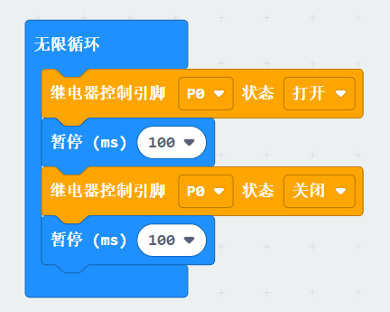
- 继电器间接性打开和关闭
### <a id="jump_4_4">4. 直流电机</a>
- 通过引脚设置直流电机的运行模式（正转和反转）和速度
- 
- <a href="https://makecode.microbit.org/_MEu01mFPmEby">示例程序</a>
- 
- 直流电机以100的速度先正转再反转
### <a id="jump_4_5">5. 舵机</a>
- 通过引脚使舵机偏转到一定的角度
- 
- <a href="https://makecode.microbit.org/_KLeAXkRyJgfw">示例程序</a>
- 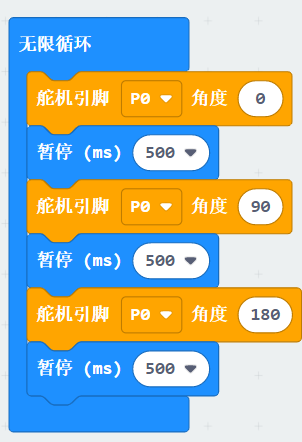
- 舵机每隔一段时间转动一定角度
### <a id="jump_4_6">6. 激光模块</a>
- 通过引脚控制激光模块的打开与关闭
- 
- <a href="https://makecode.microbit.org/_ga6b3rE3f0i9">示例程序</a>
- 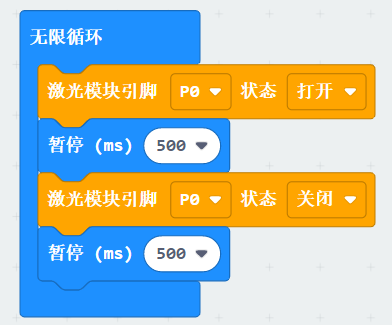
- 激光模块间接性的打开和关闭
## <a id="jump_5">智能模块</a>
### <a id="jump_5_1">1. 语音识别模块</a>
- 语音识别模块初始化
- 
- 设置唤醒时间
- 
- 匹配关键词的对应编号
- 
- 开始执行语音识别
- 
- 编辑词条库内容
- 
- 设置语音识别模式
- 
- <a href="https://makecode.microbit.org/_4J7WTLfUtWYo">示例程序</a>
- 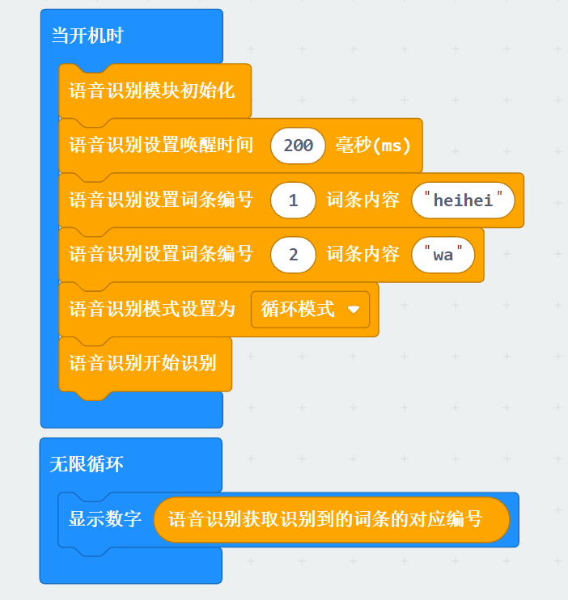
- 当执行语音识别时，接收信息与词条库匹配，匹配成功时打印词条编号，例如 接收到“xiao yi xiao yi” 打印数字2
