# Emakefun micorbit ph2.0 sensorbit extensions
### [详细介绍请看官网](https://emakefun-docs.readthedocs.io/zh_CN/latest/)
# Sensor:bit模块示例
- seneor:bit 模块有功能模块，输入模块和判断模块这几种类型，其中，功能模块为主体，积木的执行必须依赖于功能模块，输入模块可以得到数字或者字符串，用于进行数据获取或输出，判断模块返回布尔值，用来进行判断，来决定之后模块是否执行。
- 功能块示例

- 输入块示例

- 判断块示例

  
  
## 执行器
- 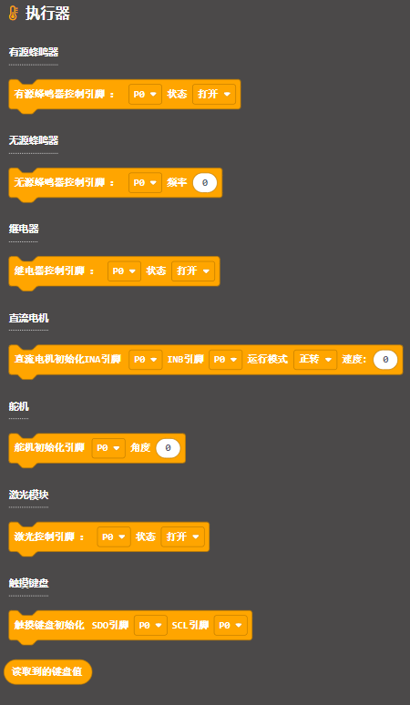
- 触摸键盘调试
- - 设置初始化引脚SCL,SDO,实现microbit读取显示键盘值的功能
- 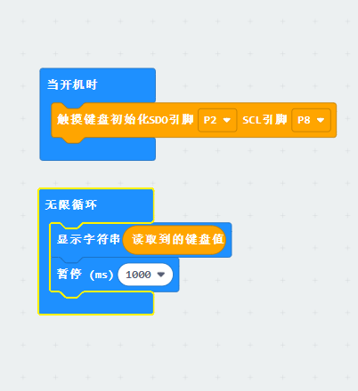

## 显示器
- 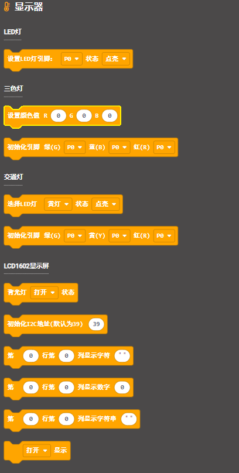
- 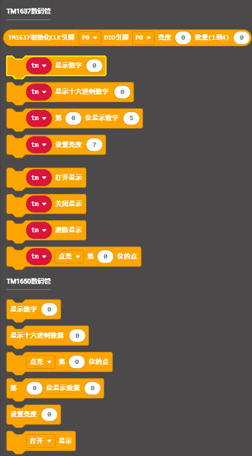
- OLED模块调试
- - OLED显示器默认连接I2C引脚(即p19，p20)，下面代码实现的效果是OLED显示的是变量ts代表的数字
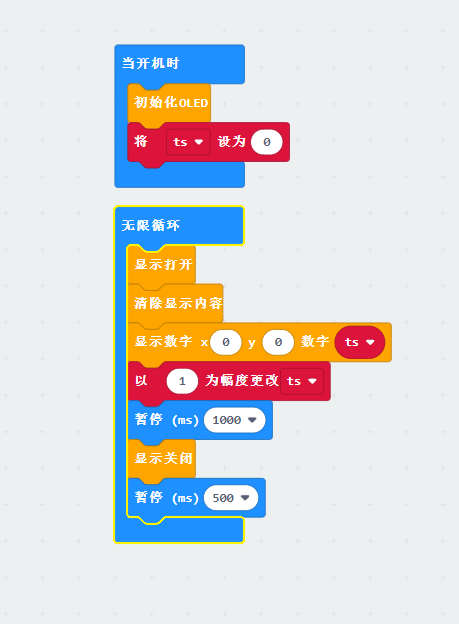

## 基础输入模块
- 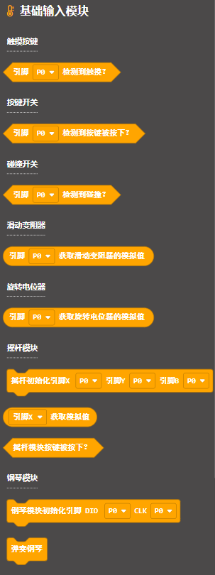
- 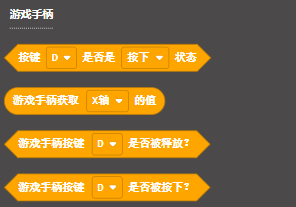
- 钢琴模块调试
- - 设置钢琴初始化引脚DIO,CLK,选择连接对应在sensor:bit上的DIO和CLK接口。
- 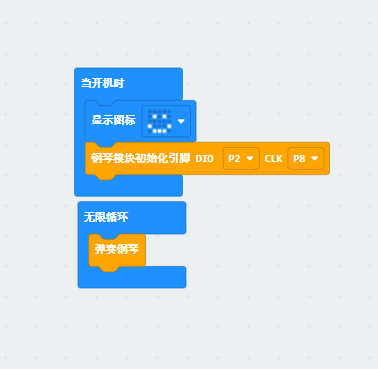

  
## 传感器
- 
- 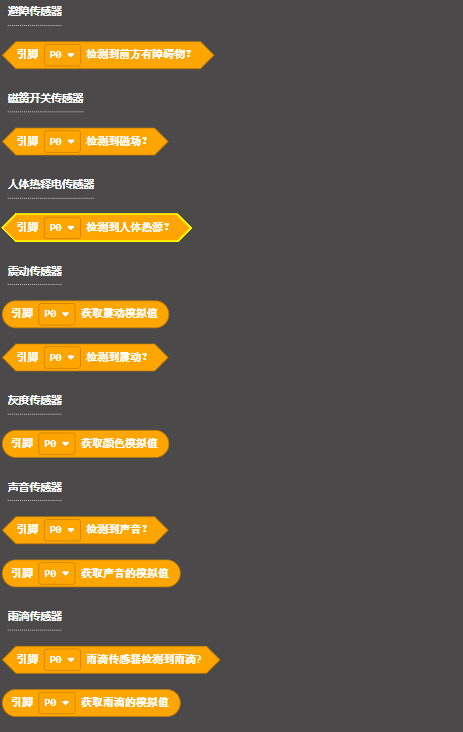
- 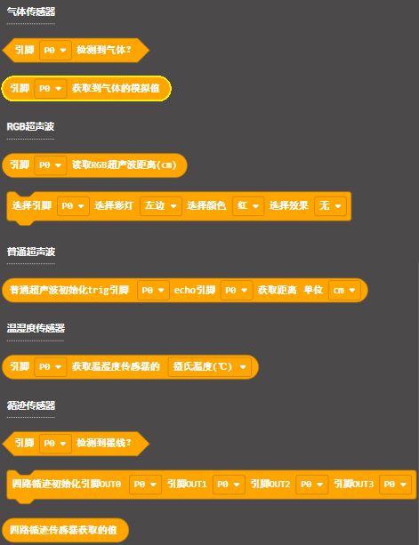
- 震动传感器调试
- - 震动传感器为4pin传感器，其A连接的pin口用于检测是否检测到震动，D口连接的pin口用于读取模拟值。
- 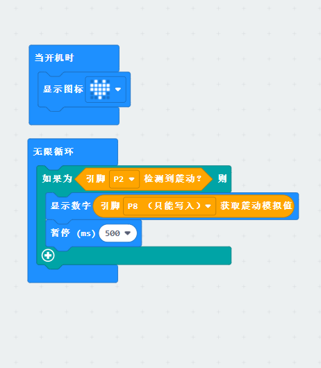

## micro:bit(v2)
- 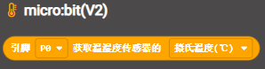

